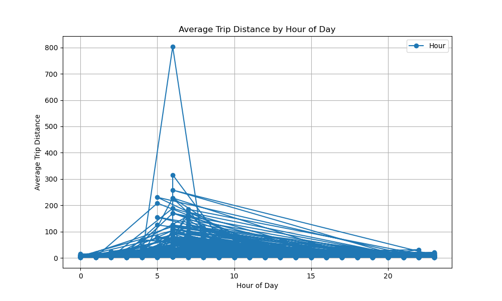
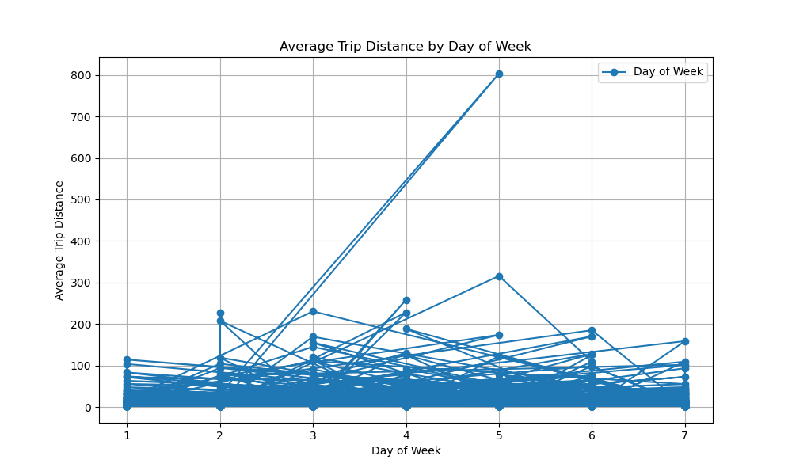
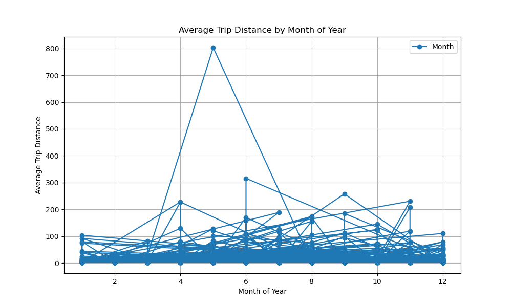
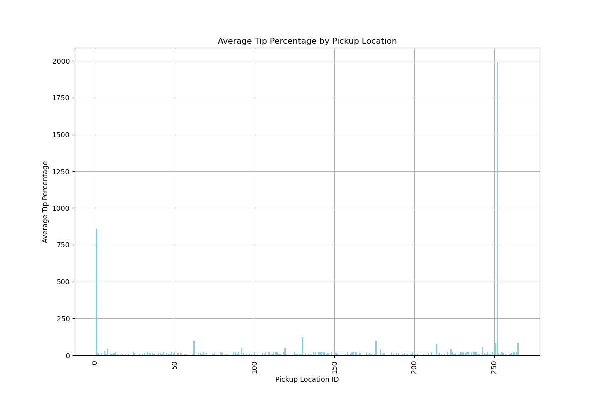
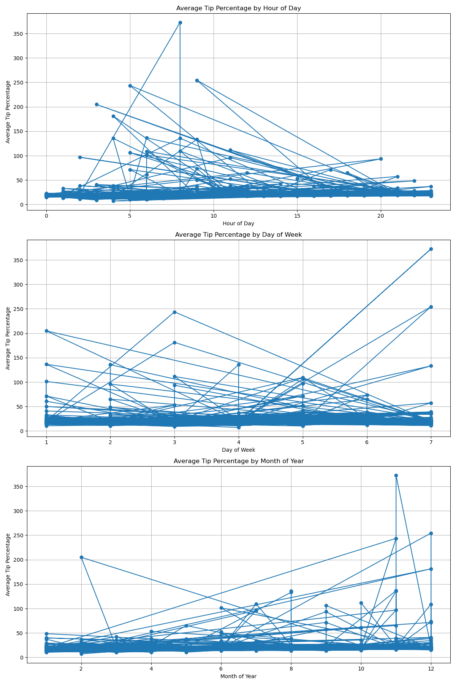
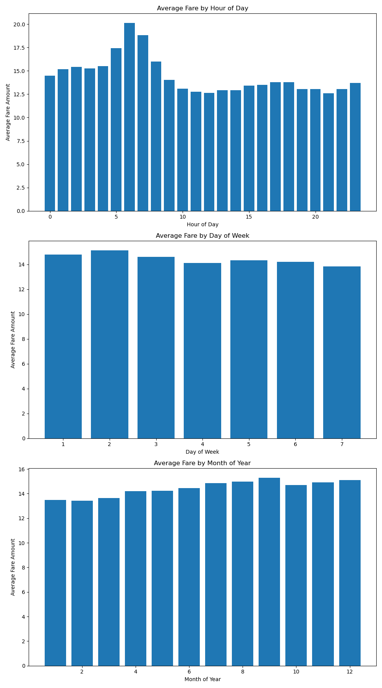

# Spark Assignment

This repository contains the code and data for analyzing NYC taxi trip data using Apache Spark on Google Cloud Platform (GCP).

## Table of Contents
- [Setup Instructions](#setup-instructions)
- [Project Structure](#project-structure)
- [Data](#data)
- [Running the Analysis Jobs](#running-the-analysis-jobs)
  - [On GCP](#on-gcp)
  - [Locally](#locally)
- [Expected Output](#expected-output)
- [Results](#results)

## Setup Instructions

### Prerequisites

- Python 3.8 or higher
- Apache Spark
- Google Cloud Platform account
- Git

### Steps

1. **Clone the repository:**
   ```bash
   git clone https://github.com/azizlahiani1639/sparkassignement.git
   cd sparkassignement
   
2. **Install the required Python packages:**
```bash
pip install -r requirements.txt
```
3. **Configure GCP and set up a Spark cluster:**
Follow the instructions in the provided assignment document to set up your Spark cluster on GCP.

## Project Structure
```bash
project/
│
├── data/                        # Input data files
│   ├── yellow_tripdata_2021-01.parquet
│   ├── yellow_tripdata_2021-02.parquet
│   └── ...                      # Additional data files
│
├── output/                      # Output files from analysis
│   ├── avg_fare_amount.csv
│   ├── avg_trip_distance.csv
│   └── ...
│
├── src/                         # Source code for analysis jobs
│   ├── jobs/
│   │   ├── demand_prediction.py
│   │   ├── fare_analysis.py
│   │   ├── tip_analysis.py
│   │   ├── traffic_analysis.py
│   │   └── trip_analysis.py
│   └── utils/
│       ├── spark_session.py
│
├── log4j.properties             # Log4j configuration file
├── requirements.txt             # Python dependencies
└── spark-submit                 # Script to submit Spark jobs
```
## Data
The data used in this project consists of NYC taxi trip records for the year 2021, available in Parquet format.

## Running the Analysis Jobs
### On GCP
Log in to your GCP account and open the Cloud Shell.

Navigate to the project directory in Cloud Shell:

```bash
cd sparkassignement
```
Submit the jobs to GCP Dataproc using the existing cluster and bucket:

Trip Analysis:

```bash
gcloud dataproc jobs submit pyspark gs://azizsto1/src/jobs/trip_analysis.py --cluster=pyspark-dataproc --region=europe-west1 -- --input-path=gs://azizsto1/data/*.parquet --output-path=gs://azizsto1/output/trip_analysis
```
Tip Analysis:

```bash
gcloud dataproc jobs submit pyspark gs://azizsto1/src/jobs/tip_analysis.py --cluster=pyspark-dataproc --region=europe-west1 -- --input-path=gs://azizsto1/data/*.parquet --output-path-location=gs://azizsto1/output/tip_by_location --output-path-time=gs://azizsto1/output/tip_by_time
```
Fare Analysis:
```bash
gcloud dataproc jobs submit pyspark gs://azizsto1/src/jobs/fare_analysis.py --cluster=pyspark-dataproc --region=europe-west1 -- --input-path=gs://azizsto1/data/*.parquet --output-path=gs://azizsto1/output/avg_fare_amount
```
Traffic Analysis:
```bash
gcloud dataproc jobs submit pyspark gs://azizsto1/src/jobs/traffic_analysis.py --cluster=pyspark-dataproc --region=europe-west1 -- --input-path=gs://azizsto1/data/*.parquet --output-path=gs://azizsto1/output/trip_count
```
Demand Prediction:
```bash
gcloud dataproc jobs submit pyspark gs://azizsto1/src/jobs/demand_predictions.py -
```
### Locally
Ensure you have the required Python packages installed:
```bash
pip install -r requirements.txt
```
Run the analysis jobs locally:

Demand Prediction:
```bash
spark-submit src/jobs/demand_prediction.py --input-path=data/yellow_tripdata_*.parquet --output-path=output/demand_prediction.csv
```
Fare Analysis:
```bash

spark-submit src/jobs/fare_analysis.py --input-path=data/yellow_tripdata_*.parquet --output-path=output/avg_fare_amount.csv
```
Tip Analysis:
```bash
spark-submit src/jobs/tip_analysis.py --input-path=data/yellow_tripdata_*.parquet --output-path-location=output/tip_by_location.csv --output-path-time=output/tip_by_time.csv
```
Traffic Analysis:
```bash
spark-submit src/jobs/traffic_analysis.py --input-path=data/yellow_tripdata_*.parquet --output-path=output/trip_count.csv
```
Trip Analysis:
```bash
spark-submit src/jobs/trip_analysis.py --input-path=data/yellow_tripdata_*.parquet --outp
```
## Expected Output

The results of the analyses will be saved in the output/ directory. Each analysis script generates specific output files:


- demand_prediction.py -> output/demand_prediction.csv

- fare_analysis.py -> output/avg_fare_amount.csv

- tip_analysis.py -> output/tip_by_location.csv, output/tip_by_time.csv

- traffic_analysis.py -> output/trip_count.csv

- trip_analysis.py -> output/avg_trip_distance.csv

## Results
After running the jobs, you should find the following output files in the output/ directory:

- avg_fare_amount.csv: Average fare amount for each month.

- avg_trip_distance.csv: Average trip distance for each month.

- demand_prediction.csv: Predicted demand for taxis.

- tip_by_location.csv: Tips categorized by pickup location.

- tip_by_time.csv: Tips categorized by time of day.

- trip_count.csv: Number of trips per day.

### Analysis of Average Trip Distance and Tip Percentage
#### Average Duration and Distance of Rides
Average Trip Distance by Time of Day, Day of Week, and Month of Year

Analyzing the average trip distance based on different time dimensions can provide valuable insights into the travel patterns in NYC.

Average Trip Distance by Hour of Day:
The analysis reveals that there is a significant peak in the early morning hours around 5 AM, where the average trip distance spikes to over 800 units. This could be attributed to long-distance trips to airports or early morning commuters.


Average Trip Distance by Day of Week:
The data shows that trip distances are relatively consistent throughout the week with a noticeable peak on certain days. The peak observed on day 4 (Thursday) with distances reaching up to 800 units suggests a pattern of longer trips during mid-week.


Average Trip Distance by Month of Year:
The monthly analysis indicates that the average trip distance is fairly stable throughout the year, with a sharp increase around April. This spike may be due to specific events or holidays causing longer trips.


These patterns suggest that while most trips are relatively short, certain times of day, specific days of the week, and particular months see significantly longer average trip distances. This information is useful for taxi companies to manage their fleet and anticipate high-demand periods.

#### Tip Analysis
Tip Percentage by Trip and Time

Tip Percentage by Pickup Location:

The data indicates a wide range of average tip percentages across different pickup locations. There are significant outliers with certain locations showing extremely high average tip percentages, reaching up to 2000%. These outliers could be due to data anomalies or specific high-tipping events at those locations. Most locations have a more modest average tip percentage, suggesting a varied tipping behavior depending on the pickup point.


Tip Percentage by Time of Day, Day of Week, and Month of Year:

Hour of Day: The average tip percentage shows a peak in the early morning hours, similar to the trip distance pattern, with tips reaching over 350%. This suggests that early morning travelers might tip more generously, possibly due to the nature of the trips being longer or airport-related.
Day of Week: The tipping pattern shows some variability throughout the week, with a notable peak on day 5 (Friday), indicating higher tips towards the weekend. This could be due to increased leisure travel or end-of-week gratuity.
Month of Year: There is considerable variability in tipping behavior throughout the year, with a significant spike in October. This peak could be associated with specific events or seasonal behaviors influencing tipping.



#### Fare Analysis
The visualizations illustrate the average fare amount by hour of the day, day of the week, and month of the year.

Average Fare by Hour of Day
The average fare amount varies significantly by hour of the day. The peak fare amounts occur early in the morning around 4-6 AM, which could be attributed to early morning travelers, possibly airport trips, or lower traffic conditions leading to higher average fares. There is a noticeable drop in the average fare amount during midday and early afternoon hours, likely due to shorter, more frequent trips.

Average Fare by Day of Week
The average fare amount does not vary drastically across the days of the week. However, there's a slight increase in the average fare on Mondays and Tuesdays, and a slight decrease on weekends. This trend might suggest a higher number of business-related or longer trips during weekdays compared to the weekends.

Average Fare by Month of Year
The average fare amount shows a fairly consistent pattern across different months, with slight peaks in the summer months (July and August) and a decrease in the early months of the year. This could be due to increased tourism and travel activities during the summer.



#### Demand Prediction
Feature Engineering:
We used the date and time of the pickups to create features for the model, such as the hour of the day, day of the week, and month of the year.

Regression Model:
A linear regression model was used to predict the number of pickups in the next hour based on these features.

Results:
The model's performance was visualized by plotting the predicted number of pickups over time.


